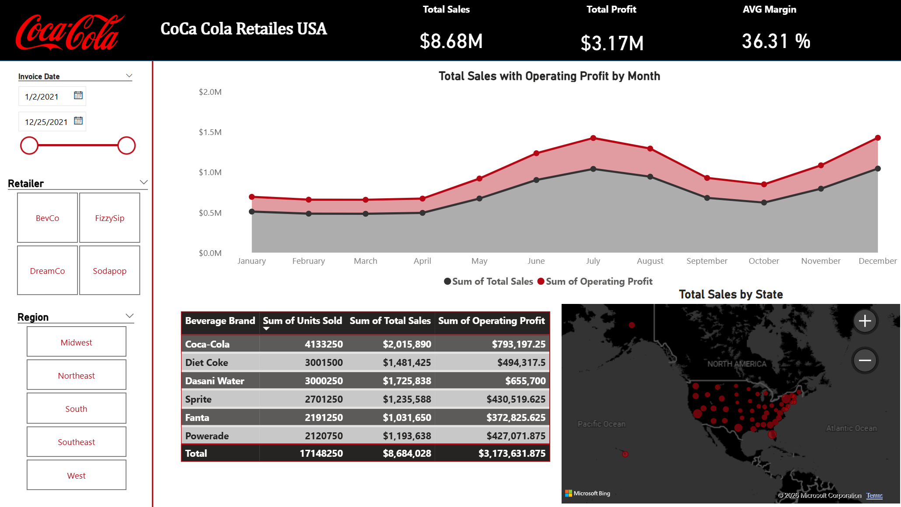

# 📊 Coca-Cola Retailers USA - Power BI Dashboard

## 📌 Project Overview
An interactive Power BI dashboard analyzing **Coca-Cola** sales and operating profitability across the United States for 2021 (Jan 2 – Dec 25). The report evaluates Key Performance Indicators (KPIs), monthly sales trends, geographic distribution, and brand performance.

> 💡 **Data Source:** Retrieved from **Kaggle**.

---

## 📸 Dashboard Preview

---

## 📈 Key Performance Indicators (KPIs)
Based on the top summary metrics:

* **Total Sales:** `$8.68M` (Exact: `$8,684,028`)
* **Total Profit:** `$3.17M` (Exact: `$3,173,631.875`)
* **Average Margin:** `36.31%`

---

## 🛠️ Interactive Slicers & Filters
The dashboard features the following interactive filtering controls in the side panel:

1. **Invoice Date Range:** `1/2/2021` to `12/25/2021`
2. **Retailer:**
   * `BevCo`
   * `FizzySip`
   * `DreamCo`
   * `Sodapop`
3. **Region:**
   * `Midwest`
   * `Northeast`
   * `South`
   * `Southeast`
   * `West`

---

## 📊 Visualizations & Analysis

### 1. Total Sales with Operating Profit by Month (Area / Line Chart)
* Visualizes the trend of **Sum of Total Sales** vs. **Sum of Operating Profit** across all months (January to December).
* Highlights major sales and profit peaks in **July** and **December**.

### 2. Breakdown by Beverage Brand (Data Table)
Detailed performance metrics per beverage brand:

| Beverage Brand | Sum of Units Sold | Sum of Total Sales | Sum of Operating Profit |
| :--- | :---: | :---: | :---: |
| **Coca-Cola** | 4,133,250 | $2,015,890 | $793,197.25 |
| **Diet Coke** | 3,001,500 | $1,481,425 | $494,317.50 |
| **Dasani Water** | 3,000,250 | $1,725,838 | $655,700.00 |
| **Sprite** | 2,701,250 | $1,235,588 | $430,519.625 |
| **Fanta** | 2,191,250 | $1,031,650 | $372,825.625 |
| **Powerade** | 2,120,750 | $1,193,638 | $427,071.875 |
| **Total** | **17,148,250** | **$8,684,028** | **$3,173,631.875** |

### 3. Total Sales by State (Geographic Map)
* Interactive map powered by Microsoft Bing, displaying sales distribution density across US states via scaled red bubble markers.

---


## 👤 About Me

### **Ibrahim Abdulrahman Alturki**
*Management Information Systems (MIS) Graduate | Data & Business Analyst*

I am a Management Information Systems (MIS) graduate passionate about bridging the gap between business logic and technical data environments. I specialize in database systems, SQL querying, and transforming raw operational data into actionable insights and decision-ready dashboards using **Power BI**.

📫 **Connect with Me:**
* 💼 **LinkedIn:** [linkedin.com/in/ibrahim-a-alturki](https://www.linkedin.com/in/ibrahim-a-alturki/)
* ✉️ **Email:** [a.alturki1@outlook.com](mailto:a.alturki1@outlook.com)

--- 

## 📁 Repository Structure
```text
powerbi-projects/cocacola-sales/
│
├── raw-data/
│   └── raw-cocacola.xlsx           # Raw Excel dataset
│
├── screenshots/
│   └── dashboard-screenshot.png    # Dashboard preview image
│
├── README.md                       # Project documentation
└── cocacola-sales.pbix             # Interactive Power BI report file
