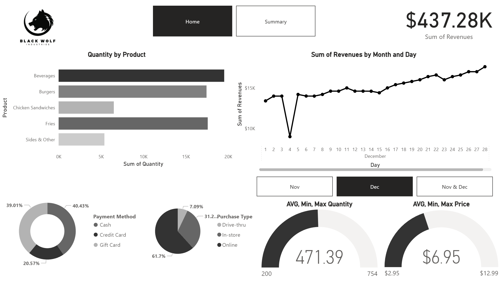
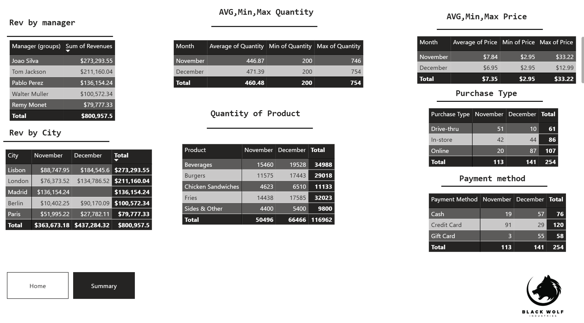

# 📊 Restaurant Sales & Operations Dashboard

## 📌 Executive Brief & Data Source
This Power BI repository presents an operational and sales performance evaluation based on an **authentic, real-world restaurant dataset sourced from Kaggle**.

> 💡 **Branding & Data Disclaimer:** 
> The brand identity **"Black Wolf Industries"** is a fictional placeholder created for dashboard design and visual hierarchy purposes. While the branding is conceptual, the underlying transactional data, metrics, and operational performance represent real restaurant activity.

The report analyzes a two-month operational window (**November and December**) across five European city locations managed by dedicated regional managers, evaluating **$800,957.50** in total revenue across **254 recorded batch transactions**.

---

## 📸 Dashboard Overview

### 1. Interactive Home Interface


### 2. Tabular Operational Summary


---

## 📈 Key Performance Indicators (KPIs)

* **Total Revenue:** `$800,957.50` (Rendered as `$800.96K`)
  * **November Revenue:** `$363,673.18`
  * **December Revenue:** `$437,284.32` (+20.24% MoM growth)
* **Total Volume Sold:** `116,962 units` (Nov: `50,496` | Dec: `66,466`)
* **Total Recorded Transactions:** `254` (Nov: `113` | Dec: `141`)
* **Average Order Quantity:** `460.48 units` (Min: `200` | Max: `754`)
* **Average Price Point:** `$7.35` (Min: `$2.95` | Max: `$33.22`)

---

## 📊 Comprehensive Data Audit & Tables

### 1. Revenue Breakdown by Regional Manager & City
| Manager | City | Nov Revenue | Dec Revenue | Total Revenue |
| :--- | :--- | :---: | :---: | :---: |
| **Joao Silva** | Lisbon | $88,747.95 | $184,545.60 | **$273,293.55** |
| **Tom Jackson** | London | $76,373.52 | $134,786.52 | **$211,160.04** |
| **Pablo Perez** | Madrid | $136,154.24 | $0.00 | **$136,154.24** |
| **Walter Muller** | Berlin | $10,402.25 | $90,170.09 | **$100,572.34** |
| **Remy Monet** | Paris | $51,995.22 | $27,782.11 | **$79,777.33** |
| **Total** | -- | **$363,673.18** | **$437,284.32** | **$800,957.50** |

---

### 2. Product Volume Distribution (Units Sold)
| Product Category | November Units | December Units | Total Volume Sold |
| :--- | :---: | :---: | :---: |
| **Beverages** | 15,460 | 19,528 | **34,988** |
| **Fries** | 14,438 | 17,585 | **32,023** |
| **Burgers** | 11,575 | 17,443 | **29,018** |
| **Chicken Sandwiches** | 4,623 | 6,510 | **11,133** |
| **Sides & Other** | 4,400 | 5,400 | **9,800** |
| **Total** | **50,496** | **66,466** | **116,962** |

---

### 3. Purchase Type & Channel Breakdown (Transactions)
| Purchase Type | Nov Orders | Dec Orders | Total Orders | Overall Share (%) |
| :--- | :---: | :---: | :---: | :---: |
| **Online** | 20 | 87 | **107** | **42.13%** |
| **In-store** | 42 | 44 | **86** | **33.86%** |
| **Drive-thru** | 51 | 10 | **61** | **24.02%** |
| **Total** | **113** | **141** | **254** | **100.00%** |

---

### 4. Payment Method Distribution (Transactions)
| Payment Method | Nov Count | Dec Count | Total Count | Overall Share (%) |
| :--- | :---: | :---: | :---: | :---: |
| **Credit Card** | 91 | 29 | **120** | **47.24%** |
| **Cash** | 19 | 57 | **76** | **29.92%** |
| **Gift Card** | 3 | 55 | **58** | **22.83%** |
| **Total** | **113** | **141** | **254** | **100.00%** |

---

### 5. Pricing & Quantity Metrics Range
| Period | Avg Quantity | Min Quantity | Max Quantity | Avg Price | Min Price | Max Price |
| :--- | :---: | :---: | :---: | :---: | :---: | :---: |
| **November** | 446.87 | 200 | 746 | $7.84 | $2.95 | $33.22 |
| **December** | 471.39 | 200 | 754 | $6.95 | $2.95 | $12.99 |
| **Combined Total** | **460.48** | **200** | **754** | **$7.35** | **$2.95** | **$33.22** |

---

## 🔍 Key Data Insights & Operational Observations

1. **Regional Anomaly (Madrid):** Madrid generated **$136,154.24** in November (making it the top-performing location that month), but recorded **$0.00** revenue in December.
2. **Channel Shift:** Drive-thru transactions dropped significantly from **51 in November** to **10 in December**, whereas Online orders surged from **20 to 87**.
3. **Product Volume Drivers:** Beverages (**34,988 units**) and Fries (**32,023 units**) represent the primary volume drivers, exceeding main food courses (Burgers at **29,018 units** and Chicken Sandwiches at **11,133 units**).

---

## 📁 Repository Structure
```text
powerbi-projects/restaurant-analysis/
│
├── raw-data/
│   └── raw-resturant.xlsx           # Authentic raw dataset (Sourced from Kaggle)
│
├── screenshots/
│   ├── dashboard-screenshot.png     # Interactive Dashboard UI
│   └── summary-screenshot.png       # Tabular Detailed View UI
│
├── README.md                        # Project documentation
└── restaurant-performance.pbix      # Interactive Power BI report file
